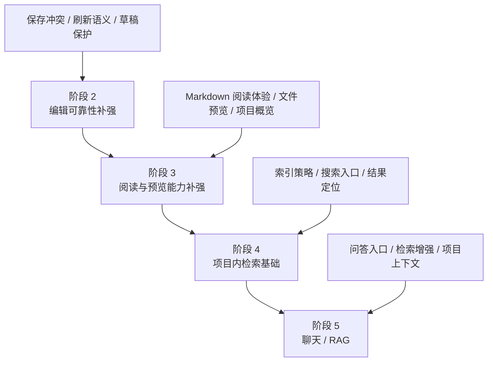

# LLM Wiki Web 后续阶段路线图

## 1. 这份文档是干什么的

这不是实施文档，也不是任务拆解清单。

这份文档只做一件事：把 `LLM Wiki Web` 在当前 `v1` 之后的阶段性方向讲清楚，让后面每次要继续推进时，都能先知道：

- 下一步最值得做什么
- 为什么现在做这个，而不是先做别的
- 每个阶段大概会影响哪些层
- 每个阶段做到什么才算完成
- 真正开始做某个阶段前，还需要先讨论什么

你可以把它理解成一份“阶段路线图”，而不是“开发计划”。

真正进入某个阶段时，仍然要再走一轮更细的流程：

1. 细致需求讨论
2. 阶段级 spec 文档
3. 实施 plan 文档
4. 代码执行与验证

## 2. 当前 v1 已经完成了什么

当前 `v1` 已经把最短闭环做出来了。它不是概念稿，而是已经能跑、能部署、能真正打开项目目录的 Web 工作台。

### 2.1 当前已经具备的能力

- 白名单项目根目录扫描
- 项目选择页
- 项目工作台页
- `Overview / Files / Purpose / Schema / Project Info` 五个主 section
- 文件树浏览
- `purpose.md`、`schema.md`、`wiki/**/*.md` 的读取与编辑
- 手动保存
- `raw/sources/*` 这类文件的元信息展示
- 路径安全校验
- PostgreSQL 项目快照与同步记录
- 基础错误状态、空状态、warning 展示

### 2.2 当前 v1 的边界

当前版本虽然已经“能用”，但它本质上还是一个 **Web 工作台 v1**，不是完整产品。

它当前的强项是：

- 能把已有项目目录桥接成 Web 工作台
- 能浏览和编辑核心 Markdown
- 能为后续搜索、问答、图谱能力打底

它当前还明显不够强的地方是：

- 编辑可靠性还需要继续补强
- 阅读体验和预览能力还比较基础
- 还没有项目内搜索
- 还没有问答、图谱、Review、Deep Research
- 还没有多用户与权限体系

一句话说，`v1` 已经把“打开项目并安全编辑核心文件”做通了，但还没有把“长期高频使用体验”和“更强的项目理解能力”做出来。

## 3. 为什么下一步不该直接跳到搜索或聊天

很多产品在这个阶段会很容易冲动：既然已经有项目、有文件、有数据库，那就直接加搜索、聊天、RAG、图谱。

这条路看起来很快，实际风险很高。

原因很简单：

1. 如果编辑工作台本身还不够稳  
后面再叠搜索、聊天、图谱，只会把已有问题放大。

2. 如果阅读体验还不够顺  
用户连“看文件、找文件、理解文件”都不舒服，问答层会变成一层很花但很虚的外挂。

3. 如果检索基础还没建立  
聊天 / RAG 最后也会退化成“靠模型硬猜项目内容”，结果不稳定，也难以解释。

所以后续阶段不建议按“最炫的功能”排序，而应该按下面这个原则排：

**先把工作台做稳，再把阅读和检索做强，最后再往理解与智能能力走。**

## 4. 阶段推进总览

## 5. 近期阶段依赖关系

## 6. 近期阶段路线图

近期建议只盯 3 个阶段：

1. 阶段 2：编辑可靠性补强
2. 阶段 3：阅读与预览能力补强
3. 阶段 4：项目内检索基础

这三个阶段的关系不是并列的，而是递进的：

- 阶段 2 解决“敢不敢长期编辑”
- 阶段 3 解决“看内容顺不顺手”
- 阶段 4 解决“找内容快不快”

只要这三层打牢，后面的聊天、RAG、图谱才是加法；否则就会变成建立在不稳底座上的炫技层。

---

## 7. 阶段 2：编辑可靠性补强

> 状态：已完成。阶段 2 已按 [spec](../../docs/superpowers/specs/2026-04-25-phase-2-editing-reliability-design.md) 和 [implementation plan](../../docs/superpowers/plans/2026-04-25-phase-2-editing-reliability.md) 落地，覆盖未保存草稿保护、保存结果反馈、冲突恢复语义和关键测试。

### 7.1 阶段目标

把当前工作台从“能编辑”提升到“适合长期稳定编辑”。

### 7.2 用户价值

这一阶段做完后，用户会明显感受到：

- 保存行为更可信
- 刷新、切换、重载时不容易丢东西
- 出错时知道到底发生了什么
- 不会因为边界情况而产生“文件到底有没有保存成功”的不确定感

这不是一个看起来很炫的阶段，但它会直接决定这个工作台是否能成为日常工具。

### 7.3 为什么现在做

当前 `v1` 已经具备完整编辑链路，所以最先暴露出来的问题一定是“可靠性”而不是“功能缺失”。

如果这一步不先做，后面无论是搜索、聊天还是图谱，都会建立在一个用户不完全信任的工作台上。那样会出现一个很危险的倒挂：

- 上层能力越来越花
- 底层编辑体验却不够稳

这种倒挂会显著拉低整个产品的可用性。

### 7.4 本阶段包含什么

- 保存冲突处理策略补强
- 未保存内容提示
- 文件切换、section 切换、页面刷新时的草稿保护语义
- 更明确的保存结果反馈
- 更一致的 reload / retry / refresh 行为
- 编辑链路里错误提示与恢复动作的统一
- 更稳的工作台状态一致性验证

### 7.5 本阶段明确不包含什么

- 自动保存
- 协同编辑
- 多用户锁
- 富文本编辑器
- 搜索
- 聊天 / RAG

这一步只解决“可靠性”和“可预期性”，不解决“功能扩张”。

### 7.6 影响面

这一阶段大概率会影响：

- 页面与交互层
  - 保存按钮行为
  - 提示信息
  - 页面离开前保护
- 状态层
  - draft / dirty / saving / refreshing 等语义
  - 工作台切换时的状态保留与清理
- 服务端路由层
  - 保存相关错误返回语义
- 文件系统桥接层
  - 保存冲突与时间戳判断
- 测试层
  - 工作台异步状态与保存场景覆盖

### 7.7 主要风险

- 交互语义过重，导致用户觉得“每一步都被打断”
- 状态逻辑进一步变复杂，反而更难维护
- 保存冲突规则如果定义得不清楚，用户会更困惑
- 保护机制过强，会让正常操作显得啰嗦

### 7.8 完成标志

达到下面这些，才算阶段 2 真正完成：

- 用户能清楚知道当前文件是否有未保存修改
- 页面刷新、文件切换、section 切换时不会无提示丢草稿
- 保存成功、保存失败、保存成功但刷新失败，这几种情况能被明确区分
- reload / retry / refresh 的行为边界一致
- 保存冲突场景至少有清晰、可解释的处理方式
- 关键编辑链路有更强的自动化测试覆盖

### 7.9 进入下一阶段前要确认的问题

- 自动保存到底要不要进入后续路线
- 冲突处理是走“简单提示”还是“显式对比”
- 草稿恢复是否需要跨页面或跨会话持久化
- 编辑历史要不要在更后面进入主线

---

## 8. 阶段 3：阅读与预览能力补强

### 8.1 阶段目标

把当前工作台从“能看内容”提升到“看内容舒服、看结构清楚、看文件更顺手”。

### 8.2 用户价值

这一阶段做完后，用户得到的不是“更多按钮”，而是更顺的阅读体验：

- Markdown 看起来更像内容，而不是原始文本
- 文件预览能力更完整
- 进入项目后能更快理解这个项目是什么
- 从项目概览到文件阅读的路径更自然

### 8.3 为什么现在做

在工作台足够稳之前，强化阅读价值没有意义；但一旦阶段 2 做完，下一步就不该直接跳检索。

原因是搜索和问答之前，用户自己仍然需要高频“读内容、扫结构、看上下文”。如果阅读体验过弱，后面再加搜索，用户也会觉得产品像一堆能力拼装，而不是一个顺手的工作台。

### 8.4 本阶段包含什么

- Markdown 阅读体验增强
- 文件只读预览体验增强
- 预览与编辑视图切换的语义补强
- 项目概览信息补强
- 文件导航与定位体验补强
- 工作台布局与信息密度优化

### 8.5 本阶段明确不包含什么

- 搜索索引
- 问答
- 图谱
- 多用户能力
- Rust bridge

### 8.6 影响面

- 页面与交互层
  - 预览模式
  - 信息布局
  - 概览信息组织
- 状态层
  - 预览 / 编辑切换状态
- 服务端路由层
  - 可能补充只读展示所需元信息
- 文件系统桥接层
  - 文件类型判断与预览策略

### 8.7 主要风险

- 预览能力一扩就容易失控，变成“做一个通用文件查看器”
- UI 层过度美化，掩盖真正的信息结构问题
- 阅读能力做太重，会挤压掉检索阶段的节奏

### 8.8 完成标志

- Markdown 内容的阅读体验明显优于当前纯文本工作台
- 非编辑型文件的只读展示比现在更完整、更清楚
- 项目概览能帮助用户更快理解项目结构
- 常见阅读路径从“进入项目”到“打开目标文件”更顺滑

### 8.9 进入下一阶段前要确认的问题

- Markdown 预览是轻量增强还是更完整渲染
- 预览和编辑是并列模式还是主辅模式
- 哪些文件类型值得继续投入只读展示能力
- 项目概览是否要引入更多结构化统计信息

---

## 9. 阶段 4：项目内检索基础

### 9.1 阶段目标

把当前工作台从“靠人手翻文件”升级到“能快速找到目标内容”。

### 9.2 用户价值

这一阶段做完后，用户会获得明显的效率提升：

- 不用再靠记忆文件位置
- 能更快找到某个主题、概念、段落或文件
- 搜索结果能直接跳到对应文件或位置
- 项目规模变大后，工作台仍然可控

### 9.3 为什么现在做

搜索是后面聊天 / RAG 的底座，但它本身也有独立价值。

比起直接做问答，先做搜索的好处是：

- 结果更可解释
- 技术风险更低
- 对用户的真实价值更直接
- 后面接 RAG 时不需要从零补检索层

### 9.4 本阶段包含什么

- 项目内搜索入口
- 搜索范围定义
- 索引生成与刷新策略
- 搜索结果列表
- 搜索结果与文件打开 / 定位联动
- 搜索态的状态反馈

### 9.5 本阶段明确不包含什么

- 对话式问答
- 推理型回答
- 跨项目智能总结
- 图谱分析
- Review / Deep Research

### 9.6 影响面

- 页面与交互层
  - 搜索入口
  - 搜索结果页或结果面板
- 状态层
  - 查询词、结果、加载态、无结果态
- 服务端路由层
  - 搜索 API
  - 索引刷新触发
- 数据层 / 索引层
  - 搜索索引存放位置
  - 刷新与同步策略
- 文件系统桥接层
  - 文本抽取与索引输入范围

### 9.7 主要风险

- 索引策略如果不清楚，后面会出现“搜不到”“结果旧”“刷新慢”
- 搜索体验如果只做到最小壳子，用户会觉得价值不明显
- 太早引入复杂检索技术，会把阶段目标做重

### 9.8 完成标志

- 用户能在项目内输入查询并获得稳定结果
- 搜索结果能跳到相关文件
- 基础索引刷新语义可解释
- 常见项目规模下搜索响应可以接受
- 搜索失败、无结果、索引未就绪等状态有明确反馈

### 9.9 进入下一阶段前要确认的问题

- 搜索索引是数据库内维护，还是独立索引层维护
- 搜索范围是否只限 Markdown，还是扩到更多文本文件
- 后续聊天 / RAG 想直接复用哪一层检索结果
- 搜索是否需要项目级摘要或标签体系辅助

---

## 10. 中长期路线图总览

### 10.1 阶段 5：聊天 / RAG / 项目级问答

这一阶段的目标不是“接个模型就完了”，而是让系统开始具备项目级问答能力。

重点会是：

- 聊天入口
- 项目级上下文组织
- 搜索结果到问答上下文的衔接
- 问答结果的可解释性

这一步只有在阶段 4 做得足够稳时才值得进入。

### 10.2 阶段 6：图谱 / Review / Deep Research

这一阶段开始进入“项目理解增强”层，不只是找内容和回答问题，而是开始帮助用户：

- 看结构
- 看关系
- 看空洞
- 看风险
- 做辅助分析

这是一条高价值路线，但复杂度明显高于前面几个阶段，不适合太早进入。

### 10.3 阶段 7：多用户 / 权限 / 协作

当前产品假设是 **单用户、自部署、同机访问项目目录**。

只要这个前提不变，多用户并不是当前主线优先级。只有未来产品定位真的变成团队协作平台，这一阶段才值得进入主线。

### 10.4 阶段 8：Rust bridge / 重能力下沉

Rust bridge 不应该作为“为了高级而高级”的技术动作进入路线图。

它更像一个后置选项，只有在下面这些问题真实出现时才值得启动：

- Node/Next 层在性能上明显吃力
- 检索、索引、解析类重任务变得很重
- 需要更强的本地能力或服务能力下沉

也就是说，它应该是 **瓶颈驱动**，而不是 **想象驱动**。

## 11. 当前优先级建议

如果现在就要定“下一步做什么”，我的建议很明确：

### 第一优先级

**阶段 2：编辑可靠性补强**

这是当前最应该做的阶段。

原因不是它最显眼，而是它最决定产品底座质量。

### 第二优先级

**阶段 3：阅读与预览能力补强**

当工作台足够稳之后，下一步应该让内容消费体验变强。

### 第三优先级

**阶段 4：项目内检索基础**

只有在“能稳地改、能顺地看”之后，搜索这件事才会真正放大产品价值。

## 12. 真正开始某个阶段前，需要补什么文档

当决定正式进入某一阶段时，建议补下面这几类文档，而不是直接开写代码：

### 12.1 阶段级 spec

回答：

- 这一阶段到底解决什么问题
- 范围边界是什么
- 用户流程是什么
- 页面结构和数据流是什么
- 错误处理与测试边界是什么

### 12.2 阶段级 implementation plan

回答：

- 实现顺序
- 模块拆分
- 风险先处理什么
- 每一步如何验证

### 12.3 如有必要，再补专题文档

比如：

- 保存冲突专题
- 搜索索引专题
- 聊天上下文专题
- 图谱数据模型专题

这些文档不需要现在写，但要知道以后什么时候值得写。

## 13. 一句话结论

`LLM Wiki Web` 当前最正确的推进顺序，不是立刻冲向聊天和图谱，而是：

**先把编辑工作台做稳，再把阅读和检索做强，最后再把智能能力接上来。**

如果后面真的要开始下一阶段，建议从 **阶段 2：编辑可靠性补强** 开始。
